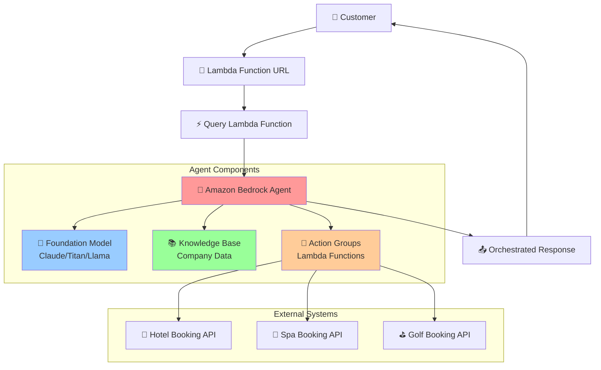
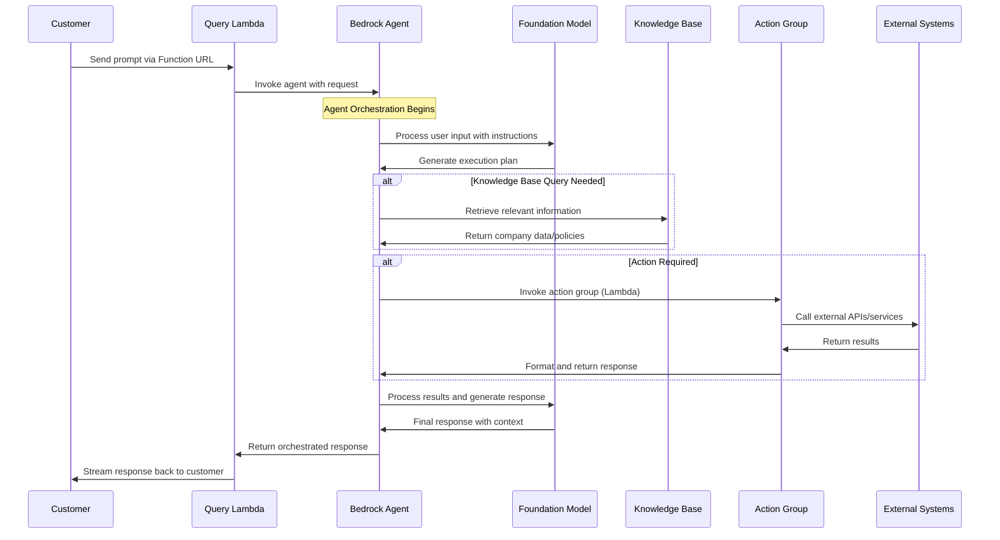
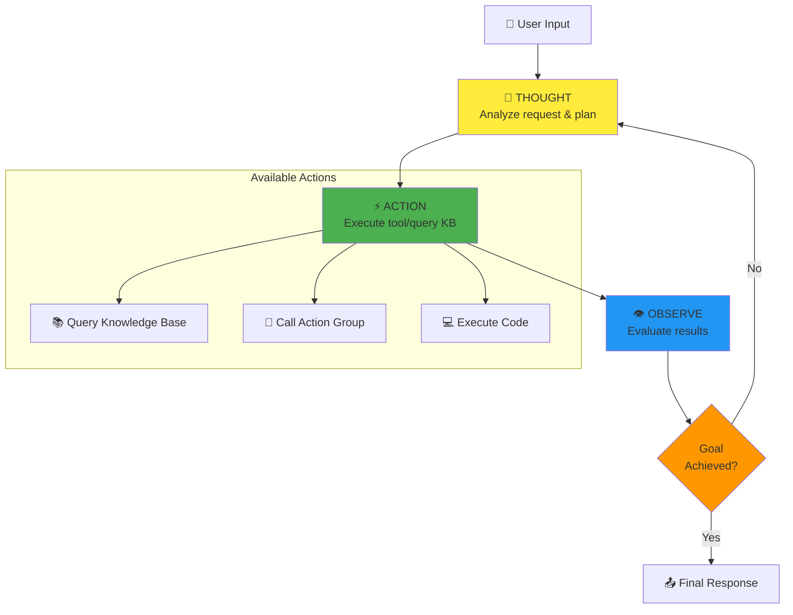
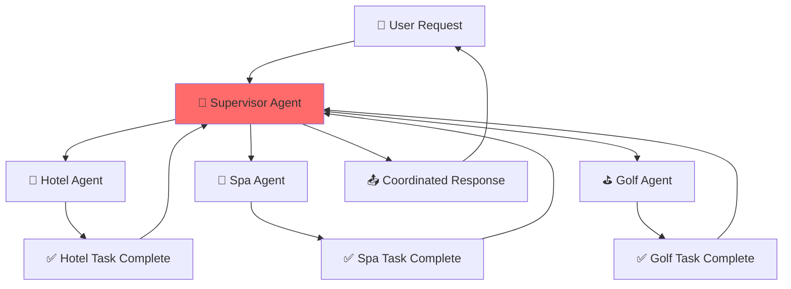
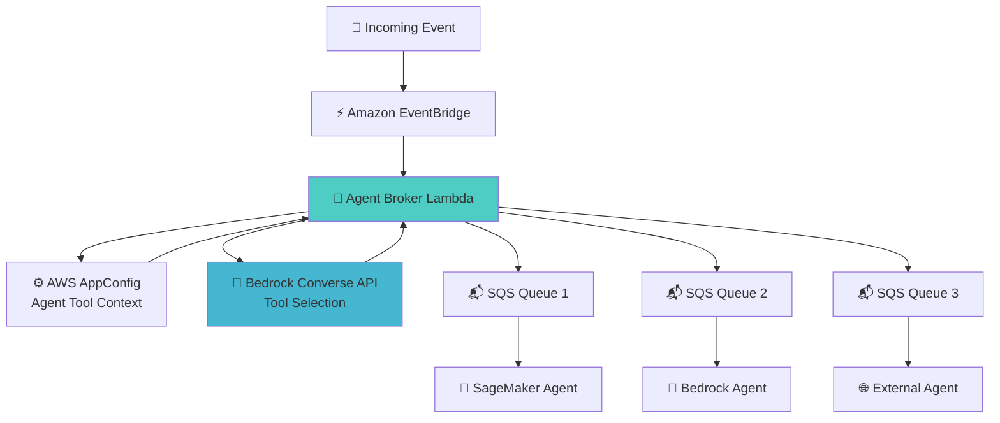
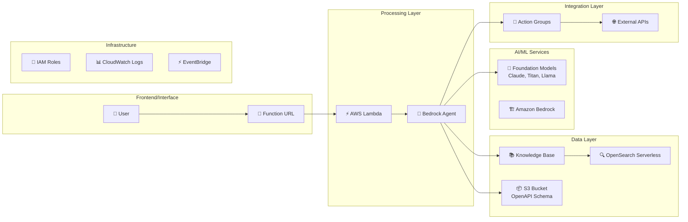
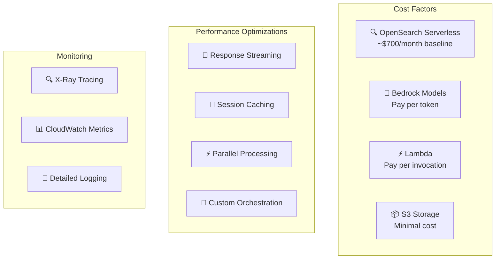

# Amazon Bedrock Agents - How It Works Flow Diagram

## 1. High-Level Architecture Flow



## 2. Detailed Agent Processing Flow



## 3. Agent Internal Processing (ReAct Framework)



## 4. Complete Example: Hotel Booking Workflow

```mermaid
graph TB
    Start[🗣️ "Book a hotel room on 2024-02-25"] --> Agent[🤖 Bedrock Agent]
    
    Agent --> Step1[🤔 THOUGHT: Need to check availability]
    Step1 --> Action1[⚡ ACTION: GET /rooms API]
    Action1 --> Lambda1[⚡ Action Group Lambda]
    Lambda1 --> HotelAPI1[🏨 Hotel System: Get Available Rooms]
    HotelAPI1 --> Observe1[👁️ OBSERVE: List of available rooms]
    
    Observe1 --> Step2[🤔 THOUGHT: Present options to user]
    Step2 --> UserChoice[👤 User selects: "Deluxe room for $160"]
    
    UserChoice --> Step3[🤔 THOUGHT: Need to book selected room]
    Step3 --> Action2[⚡ ACTION: POST /rooms API]
    Action2 --> Lambda2[⚡ Action Group Lambda]
    Lambda2 --> HotelAPI2[🏨 Hotel System: Book Room 109]
    HotelAPI2 --> Observe2[👁️ OBSERVE: Booking confirmed]
    
    Observe2 --> Final[📤 "Room 109 booked for 2024-02-25, $160"]
    
    style Agent fill:#ff9999
    style Step1 fill:#ffeb3b
    style Step2 fill:#ffeb3b
    style Step3 fill:#ffeb3b
    style Action1 fill:#4caf50
    style Action2 fill:#4caf50
    style Observe1 fill:#2196f3
    style Observe2 fill:#2196f3
```

## 5. Multi-Agent Patterns

### A. Supervisor Pattern


### B. Event-Driven Broker Pattern


## 6. Technical Stack Components



## 7. Cost and Performance Considerations



## Key Features Highlighted:

1. **Orchestration**: Agent coordinates multiple services and APIs
2. **Context Awareness**: Maintains conversation history and session state
3. **Dynamic Routing**: Intelligently selects appropriate tools/actions
4. **Scalability**: Serverless architecture scales automatically
5. **Flexibility**: Event-driven patterns support complex workflows
6. **Monitoring**: Comprehensive observability and tracing
7. **Security**: IAM-based access control and guardrails